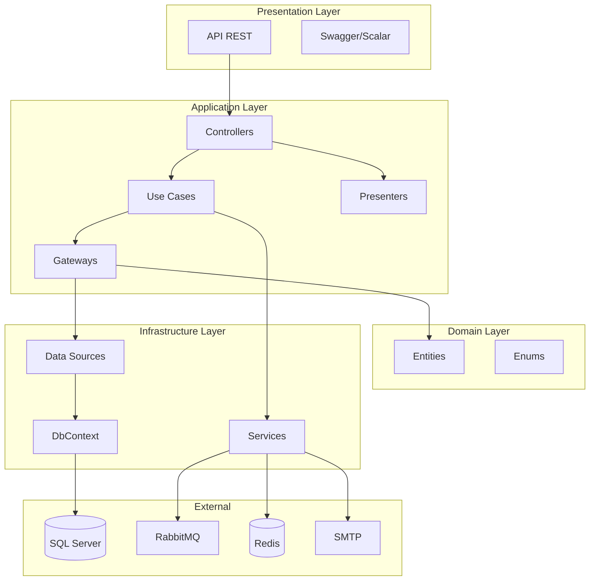
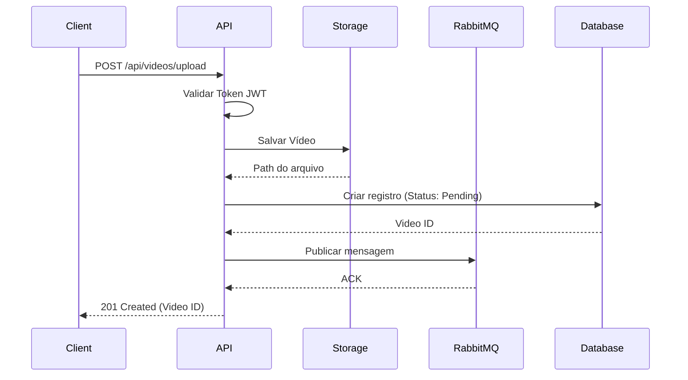
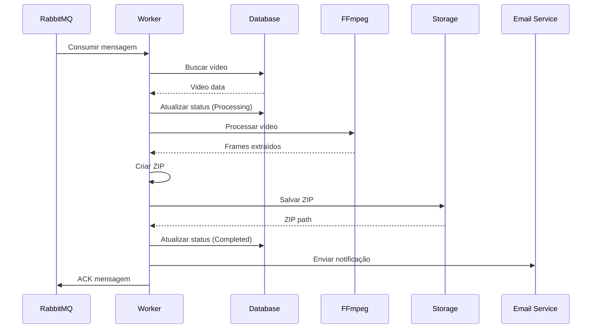
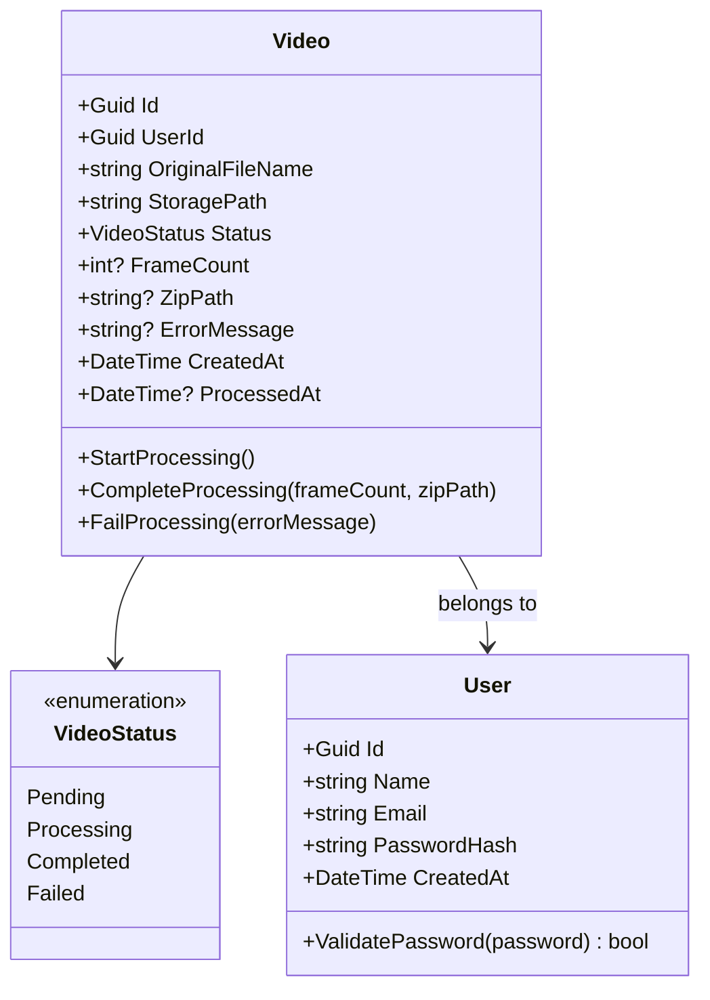
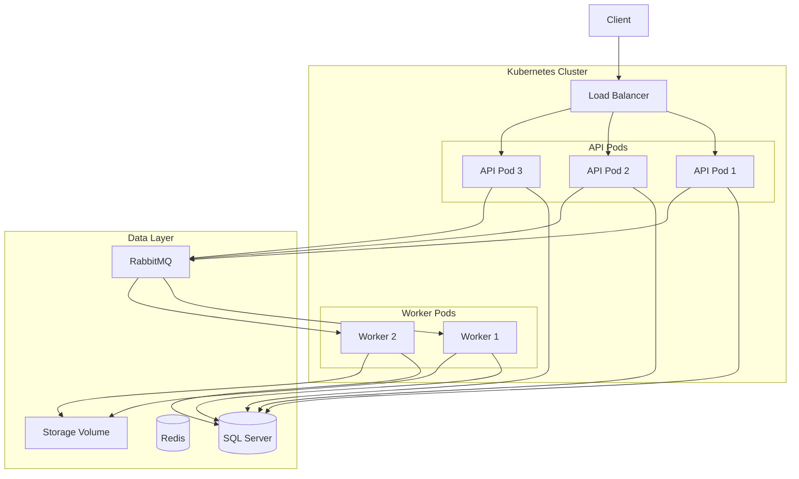

# Documentação de Arquitetura - FIAP X

## 1. Visão Geral

O FIAP X é um sistema de processamento de vídeos que extrai frames e gera arquivos ZIP para download. Foi desenvolvido utilizando Clean Architecture em .NET 8, garantindo escalabilidade, manutenibilidade e testabilidade.

## 2. Decisões Arquiteturais

### 2.1 Clean Architecture

A escolha pela Clean Architecture se baseia em:
- **Independência de frameworks**: O domínio não depende de bibliotecas externas
- **Testabilidade**: Cada camada pode ser testada isoladamente
- **Independência de UI**: A API pode ser substituída sem afetar regras de negócio
- **Independência de banco de dados**: O SQL Server pode ser trocado facilmente

### 2.2 Mensageria com RabbitMQ

Para garantir resiliência e processamento assíncrono:
- Vídeos são enfileirados para processamento
- Workers consomem a fila de forma distribuída
- Em caso de falha, mensagens são reprocessadas
- Permite escalar workers horizontalmente

### 2.3 Autenticação JWT

- Tokens stateless para escalabilidade
- Não requer sessão no servidor
- Permite múltiplas instâncias da API

## 3. Diagramas

### 3.1 Diagrama de Componentes



### 3.2 Diagrama de Sequência - Upload de Vídeo



### 3.3 Diagrama de Sequência - Processamento



### 3.4 Diagrama de Classes - Domain



### 3.5 Diagrama de Infraestrutura



## 4. Estrutura de Pastas

```
FiapX/
├── src/
│   ├── FiapX.API/                 # Camada de apresentação
│   │   ├── Endpoints/             # Minimal APIs
│   │   ├── Extensions/            # Configurações e middlewares
│   │   └── Program.cs
│   │
│   ├── FiapX.Application/         # Camada de aplicação
│   │   ├── Controllers/           # Orquestradores de use cases
│   │   ├── Gateways/              # Abstrações de dados
│   │   ├── Interfaces/            # Contratos
│   │   ├── Presenter/             # Transformação de dados
│   │   └── UseCases/              # Casos de uso
│   │
│   ├── FiapX.Domain/              # Camada de domínio
│   │   ├── Entities/              # Entidades de negócio
│   │   └── Enums/                 # Enumerações
│   │
│   ├── FiapX.Infrastructure/      # Camada de infraestrutura
│   │   ├── DataSources/           # Implementações de acesso a dados
│   │   ├── DbContexts/            # Entity Framework
│   │   ├── DbModels/              # Modelos de banco
│   │   ├── Services/              # Serviços externos
│   │   └── Migrations/            # Migrations EF
│   │
│   ├── FiapX.Shared/              # Código compartilhado
│   │   ├── DTO/                   # Data Transfer Objects
│   │   └── Result/                # Padrão Result
│   │
│   └── FiapX.Worker/              # Worker de processamento
│
├── tests/
│   └── FiapX.UnitTests/           # Testes unitários
│
├── docs/                          # Documentação
├── .github/workflows/             # CI/CD
├── docker-compose.yml
├── Dockerfile
└── README.md
```

## 5. Fluxo de Dados

### 5.1 Camadas e Responsabilidades

| Camada | Responsabilidade |
|--------|------------------|
| **API** | Receber requisições HTTP, validar, rotear para controllers |
| **Application** | Orquestrar casos de uso, transformar dados |
| **Domain** | Regras de negócio, validações de entidade |
| **Infrastructure** | Acesso a dados, serviços externos |
| **Shared** | DTOs, interfaces comuns |

### 5.2 Padrões Utilizados

- **Gateway Pattern**: Abstração de acesso a dados
- **Use Case Pattern**: Encapsulamento de regras de negócio
- **Presenter Pattern**: Transformação de entidades para DTOs
- **Result Pattern**: Retorno padronizado de operações
- **Factory Method**: Criação de instâncias nos use cases

## 6. Escalabilidade

### 6.1 Horizontal

- **API**: Múltiplas instâncias atrás de load balancer
- **Workers**: Escalar conforme demanda de processamento
- **Banco**: Réplicas de leitura

### 6.2 Vertical

- Ajustar recursos de containers conforme necessidade
- Otimizar queries do Entity Framework

## 7. Monitoramento

- **Health Checks**: `/health` para verificação de saúde
- **Dashboard**: `/dashboard` para visualização
- **Logs**: Serilog com output para console e arquivo
- **Métricas**: Preparado para Prometheus/Grafana

## 8. Segurança

- Autenticação JWT com expiração
- Senhas hasheadas com SHA256
- CORS configurado
- Validação de tipos de arquivo
- Isolamento de dados por usuário
