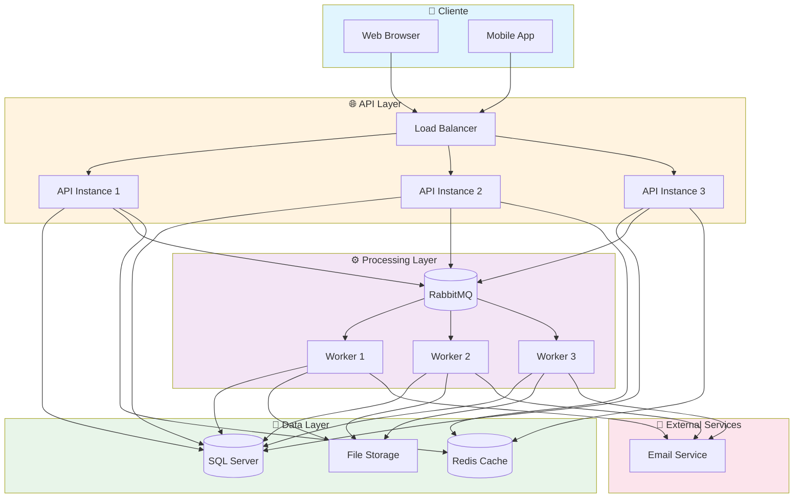
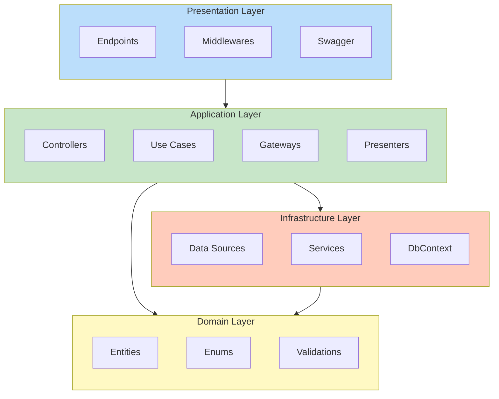
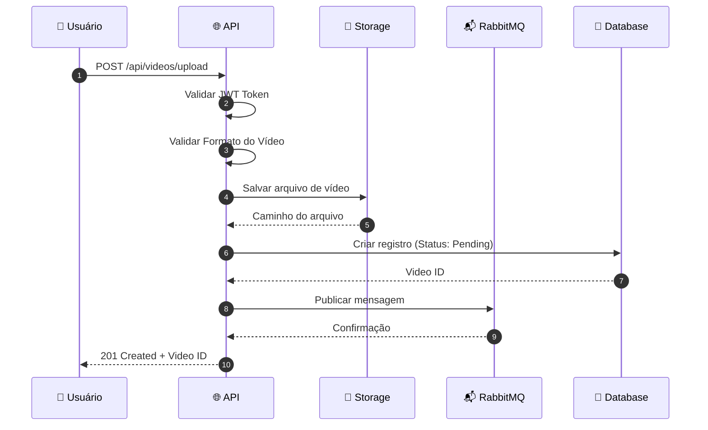
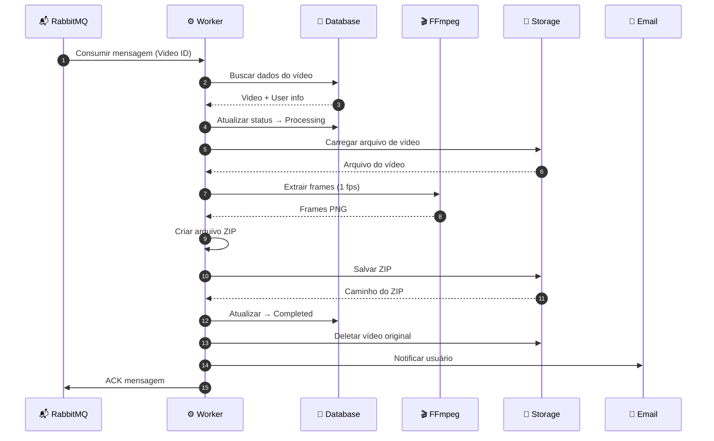
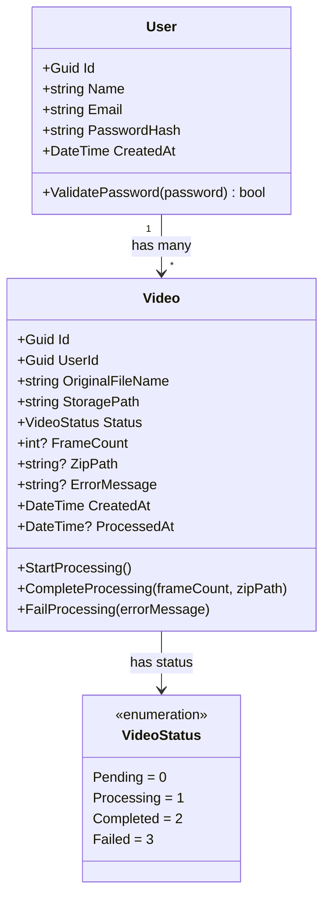
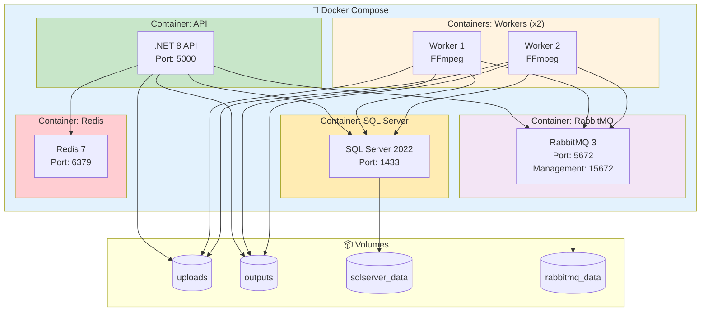
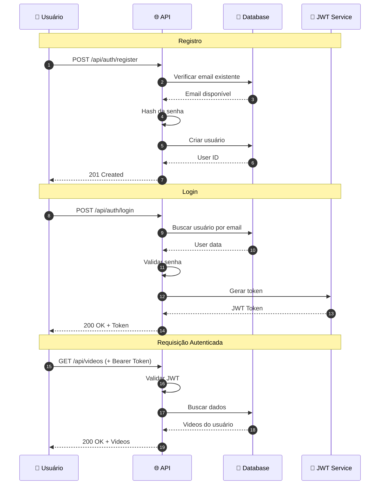
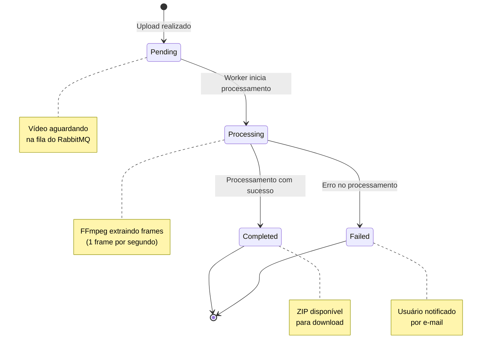
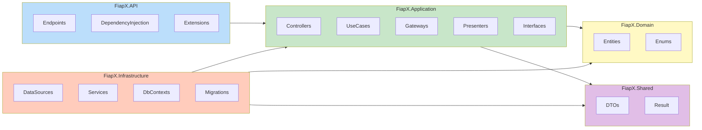
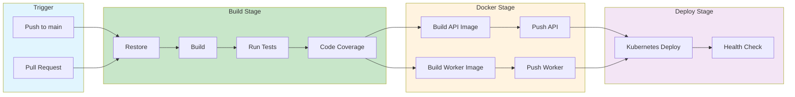

# Diagramas FIAP X

## 1. Arquitetura de Alto Nível

## 2. Clean Architecture

## 3. Fluxo de Upload de Vídeo

## 4. Fluxo de Processamento

## 5. Diagrama de Classes - Entidades

## 6. Diagrama de Implantação (Docker)

## 7. Fluxo de Autenticação

## 8. Estados do Vídeo

## 9. Estrutura de Camadas

## 10. CI/CD Pipeline

